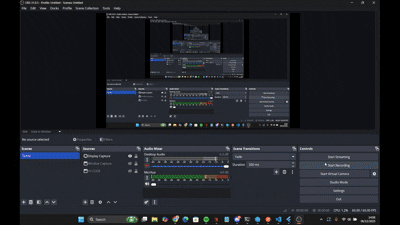

# Responsi 2 Mobile Paket 2 - Aplikasi Inventaris Bahan Makanan

## Identitas Mahasiswa
- **Nama**: Renggo
- **NIM**: H1D023012
- **Shift Baru**: B
- **Shift Asal**: H

---

## 📱 Demo Aplikasi



*Video demo menampilkan fitur-fitur utama aplikasi: Login, Register, CRUD Inventaris Bahan Makanan*

---

## 🎯 Deskripsi Aplikasi

Aplikasi **Inventaris Bahan Renggomart** adalah sistem manajemen inventaris bahan makanan yang dibangun menggunakan Flutter untuk frontend dan CodeIgniter 4 untuk backend API. Aplikasi ini memungkinkan pengguna untuk mengelola data inventaris bahan makanan dengan fitur lengkap CRUD (Create, Read, Update, Delete).

### Fitur Utama:
✅ Autentikasi (Login & Register)  
✅ Tambah data inventaris bahan makanan  
✅ Lihat daftar inventaris  
✅ Edit data inventaris  
✅ Hapus data inventaris  
✅ Logout  

---

## 🛠️ Teknologi yang Digunakan

### Frontend (Flutter)
- **Flutter SDK**: ^3.9.2
- **Dart**: ^3.9.2
- **Dependencies**:
  - `http`: ^1.2.2 - Untuk komunikasi dengan REST API
  - `shared_preferences`: ^2.3.3 - Untuk menyimpan session login
  - `intl`: ^0.19.0 - Untuk format currency dan date

### Backend (CodeIgniter 4)
- **Framework**: CodeIgniter 4.6.3
- **PHP**: 8.3.16
- **Database**: MySQL
- **Server**: PHP Built-in Server

---

## 📡 Spesifikasi API

### Base URL
```
http://localhost:8080/api
```

### Endpoints

#### 1. **Register** 
```http
POST /api/register
```
**Request Body:**
```json
{
  "username": "string",
  "email": "string",
  "password": "string"
}
```
**Response Success (201):**
```json
{
  "status": "success",
  "message": "Registrasi berhasil",
  "data": {
    "id": 1,
    "username": "renggo",
    "email": "renggo@gmail.com"
  }
}
```
**Response Error (400):**
```json
{
  "status": "error",
  "message": "Registrasi gagal",
  "errors": {
    "username": "Username sudah digunakan",
    "email": "Email tidak valid"
  }
}
```

#### 2. **Login**
```http
POST /api/login
```
**Request Body:**
```json
{
  "username": "string",
  "password": "string"
}
```
**Response Success (200):**
```json
{
  "status": "success",
  "message": "Login berhasil",
  "data": {
    "id": 1,
    "username": "renggo",
    "email": "renggo@gmail.com"
  }
}
```
**Response Error (401):**
```json
{
  "status": "error",
  "message": "Password salah"
}
```

#### 3. **Get All Inventaris**
```http
GET /api/inventaris?user_id={user_id}
```
**Response Success (200):**
```json
{
  "status": "success",
  "message": "Data inventaris berhasil diambil",
  "data": [
    {
      "id": 1,
      "user_id": 1,
      "nama": "Beras Premium",
      "harga": 85000,
      "jumlah": 50,
      "tanggal_masuk": "2025-12-01",
      "tanggal_kedaluwarsa": "2026-12-01",
      "created_at": "2025-12-06 12:00:00",
      "updated_at": "2025-12-06 12:00:00"
    }
  ]
}
```

#### 4. **Get Single Inventaris**
```http
GET /api/inventaris/{id}
```
**Response Success (200):**
```json
{
  "status": "success",
  "message": "Data inventaris ditemukan",
  "data": {
    "id": 1,
    "user_id": 1,
    "nama": "Beras Premium",
    "harga": 85000,
    "jumlah": 50,
    "tanggal_masuk": "2025-12-01",
    "tanggal_kedaluwarsa": "2026-12-01"
  }
}
```

#### 5. **Create Inventaris**
```http
POST /api/inventaris
```
**Request Body:**
```json
{
  "user_id": 1,
  "nama": "string",
  "harga": 0,
  "jumlah": 0,
  "tanggal_masuk": "YYYY-MM-DD",
  "tanggal_kedaluwarsa": "YYYY-MM-DD"
}
```
**Response Success (201):**
```json
{
  "status": "success",
  "message": "Data inventaris berhasil ditambahkan",
  "data": {
    "id": 1,
    "user_id": 1,
    "nama": "Beras Premium",
    "harga": 85000,
    "jumlah": 50,
    "tanggal_masuk": "2025-12-01",
    "tanggal_kedaluwarsa": "2026-12-01"
  }
}
```

#### 6. **Update Inventaris**
```http
PUT /api/inventaris/{id}
```
**Request Body:**
```json
{
  "nama": "string",
  "harga": 0,
  "jumlah": 0,
  "tanggal_masuk": "YYYY-MM-DD",
  "tanggal_kedaluwarsa": "YYYY-MM-DD"
}
```
**Response Success (200):**
```json
{
  "status": "success",
  "message": "Data inventaris berhasil diupdate",
  "data": {
    "id": 1,
    "nama": "Beras Super Premium",
    "harga": 95000,
    "jumlah": 45
  }
}
```

#### 7. **Delete Inventaris**
```http
DELETE /api/inventaris/{id}
```
**Response Success (200):**
```json
{
  "status": "success",
  "message": "Data inventaris berhasil dihapus"
}
```

---

## 📂 Struktur Folder

```
lib/
├── main.dart                      # Entry point aplikasi
├── pages/
│   ├── login_page.dart           # Halaman login
│   ├── register_page.dart        # Halaman register
│   ├── inventaris_list_page.dart # Halaman daftar inventaris
│   └── inventaris_form_page.dart # Halaman form tambah/edit inventaris
└── services/
    └── api_service.dart          # Service untuk komunikasi dengan API
```

---

## 💡 Penjelasan Kode

### 1. **main.dart**

File ini adalah entry point aplikasi yang berisi konfigurasi tema dan routing awal.

```dart
void main() {
  runApp(const MyApp());
}
```

**Class MyApp:**
- Mengatur tema aplikasi dengan warna hijau sebagai primary color
- Menampilkan SplashScreen sebagai halaman awal

**Class SplashScreen:**
- Mengecek status login user menggunakan SharedPreferences
- Jika user sudah login (ada `user_id`), redirect ke `InventarisListPage`
- Jika belum login, redirect ke `LoginPage`

**Fungsi Utama:**
```dart
Future<void> _checkLogin() async {
  final prefs = await SharedPreferences.getInstance();
  final userId = prefs.getInt('user_id');
  
  if (userId != null) {
    // User sudah login, ke halaman inventaris
  } else {
    // User belum login, ke halaman login
  }
}
```

---

### 2. **api_service.dart**

Service class yang menangani semua komunikasi dengan REST API backend.

#### **A. Register**
```dart
static Future<Map<String, dynamic>> register({
  required String username,
  required String email,
  required String password,
}) async {
  final response = await http.post(
    Uri.parse('$baseUrl/register'),
    headers: {'Content-Type': 'application/json'},
    body: jsonEncode({
      'username': username,
      'email': email,
      'password': password,
    }),
  );
  return jsonDecode(response.body);
}
```
**Penjelasan:**
- Mengirim request POST ke endpoint `/register`
- Mengirimkan data username, email, dan password dalam format JSON
- Mengembalikan response dari server

#### **B. Login**
```dart
static Future<Map<String, dynamic>> login({
  required String username,
  required String password,
}) async {
  final response = await http.post(
    Uri.parse('$baseUrl/login'),
    headers: {'Content-Type': 'application/json'},
    body: jsonEncode({'username': username, 'password': password}),
  );
  
  final data = jsonDecode(response.body);
  
  if (data['status'] == 'success') {
    final prefs = await SharedPreferences.getInstance();
    final userId = data['data']['id'];
    await prefs.setInt('user_id', userId is int ? userId : int.parse(userId.toString()));
    await prefs.setString('username', data['data']['username'].toString());
    await prefs.setString('email', data['data']['email'].toString());
  }
  
  return data;
}
```
**Penjelasan:**
- Mengirim request POST ke endpoint `/login`
- Jika login berhasil, menyimpan `user_id`, `username`, dan `email` ke SharedPreferences
- SharedPreferences digunakan untuk maintain session login

#### **C. Get Inventaris**
```dart
static Future<List<dynamic>> getInventaris() async {
  final userId = await getUserId();
  final response = await http.get(
    Uri.parse('$baseUrl/inventaris?user_id=$userId'),
    headers: {'Content-Type': 'application/json'},
  );
  
  final data = jsonDecode(response.body);
  if (data['status'] == 'success') {
    return data['data'];
  }
  return [];
}
```
**Penjelasan:**
- Mengambil semua data inventaris milik user yang sedang login
- Filter berdasarkan `user_id` dari SharedPreferences

#### **D. Create Inventaris**
```dart
static Future<Map<String, dynamic>> createInventaris({
  required String nama,
  required int harga,
  required int jumlah,
  required String tanggalMasuk,
  required String tanggalKedaluwarsa,
}) async {
  final userId = await getUserId();
  final response = await http.post(
    Uri.parse('$baseUrl/inventaris'),
    headers: {'Content-Type': 'application/json'},
    body: jsonEncode({
      'user_id': userId,
      'nama': nama,
      'harga': harga,
      'jumlah': jumlah,
      'tanggal_masuk': tanggalMasuk,
      'tanggal_kedaluwarsa': tanggalKedaluwarsa,
    }),
  );
  return jsonDecode(response.body);
}
```
**Penjelasan:**
- Menambahkan data inventaris baru
- Otomatis mengambil `user_id` dari session
- Mengirim semua field yang diperlukan dalam format JSON

#### **E. Update Inventaris**
```dart
static Future<Map<String, dynamic>> updateInventaris({
  required int id,
  required String nama,
  required int harga,
  required int jumlah,
  required String tanggalMasuk,
  required String tanggalKedaluwarsa,
}) async {
  final response = await http.put(
    Uri.parse('$baseUrl/inventaris/$id'),
    headers: {'Content-Type': 'application/json'},
    body: jsonEncode({
      'nama': nama,
      'harga': harga,
      'jumlah': jumlah,
      'tanggal_masuk': tanggalMasuk,
      'tanggal_kedaluwarsa': tanggalKedaluwarsa,
    }),
  ).timeout(const Duration(seconds: 10));
  
  return jsonDecode(response.body);
}
```
**Penjelasan:**
- Mengupdate data inventaris berdasarkan ID
- Menggunakan method HTTP PUT
- Timeout 10 detik untuk mencegah hanging

#### **F. Delete Inventaris**
```dart
static Future<Map<String, dynamic>> deleteInventaris(int id) async {
  final response = await http.delete(
    Uri.parse('$baseUrl/inventaris/$id'),
    headers: {'Content-Type': 'application/json'},
  ).timeout(const Duration(seconds: 10));
  
  return jsonDecode(response.body);
}
```
**Penjelasan:**
- Menghapus data inventaris berdasarkan ID
- Menggunakan method HTTP DELETE

#### **G. Logout**
```dart
static Future<void> logout() async {
  final prefs = await SharedPreferences.getInstance();
  await prefs.clear();
}
```
**Penjelasan:**
- Menghapus semua data session dari SharedPreferences
- User akan logout dan kembali ke halaman login

---

### 3. **login_page.dart**

Halaman untuk user melakukan login.

#### **State Management:**
```dart
final _formKey = GlobalKey<FormState>();
final _usernameController = TextEditingController();
final _passwordController = TextEditingController();
bool _isLoading = false;
```
**Penjelasan:**
- `_formKey`: Untuk validasi form
- `_usernameController` & `_passwordController`: Mengontrol input field
- `_isLoading`: State untuk menampilkan loading indicator

#### **Fungsi Login:**
```dart
Future<void> _login() async {
  if (!_formKey.currentState!.validate()) return;
  
  setState(() => _isLoading = true);
  
  final result = await ApiService.login(
    username: _usernameController.text,
    password: _passwordController.text,
  );
  
  setState(() => _isLoading = false);
  
  if (result['status'] == 'success') {
    Navigator.pushReplacement(
      context,
      MaterialPageRoute(builder: (context) => const InventarisListPage()),
    );
  } else {
    ScaffoldMessenger.of(context).showSnackBar(
      SnackBar(content: Text(result['message']), backgroundColor: Colors.red),
    );
  }
}
```
**Penjelasan:**
- Validasi input form
- Set loading state true saat proses login
- Panggil `ApiService.login()`
- Jika berhasil, navigasi ke halaman inventaris
- Jika gagal, tampilkan error message dengan SnackBar

#### **UI Components:**
- AppBar hijau dengan title "Login Inventaris Bahan Renggomart"
- Form dengan 2 input: username dan password
- Button login dengan loading indicator
- Link ke halaman register

---

### 4. **register_page.dart**

Halaman untuk user membuat akun baru.

#### **State Management:**
```dart
final _formKey = GlobalKey<FormState>();
final _usernameController = TextEditingController();
final _emailController = TextEditingController();
final _passwordController = TextEditingController();
bool _isLoading = false;
```

#### **Fungsi Register:**
```dart
Future<void> _register() async {
  if (!_formKey.currentState!.validate()) return;
  
  setState(() => _isLoading = true);
  
  final result = await ApiService.register(
    username: _usernameController.text,
    email: _emailController.text,
    password: _passwordController.text,
  );
  
  setState(() => _isLoading = false);
  
  if (result['status'] == 'success') {
    Navigator.pop(context); // Kembali ke login page
  } else {
    // Tampilkan error
    String errorMessage = result['message'];
    if (result['errors'] != null) {
      final errors = result['errors'] as Map<String, dynamic>;
      errorMessage = errors.values.join('\n');
    }
    ScaffoldMessenger.of(context).showSnackBar(
      SnackBar(content: Text(errorMessage), backgroundColor: Colors.red),
    );
  }
}
```
**Penjelasan:**
- Validasi input (username min 3 karakter, email valid, password min 6 karakter)
- Panggil `ApiService.register()`
- Jika berhasil, kembali ke halaman login
- Jika gagal, tampilkan error dari server (validasi backend)

#### **Validasi Input:**
```dart
TextFormField(
  validator: (value) {
    if (value == null || value.isEmpty) {
      return 'Username tidak boleh kosong';
    }
    if (value.length < 3) {
      return 'Username minimal 3 karakter';
    }
    return null;
  },
)
```

---

### 5. **inventaris_list_page.dart**

Halaman utama yang menampilkan daftar inventaris dengan fitur CRUD.

#### **State Management:**
```dart
List<dynamic> _inventarisList = [];
bool _isLoading = true;
final NumberFormat _currencyFormat = NumberFormat.currency(
  locale: 'id_ID',
  symbol: 'Rp ',
  decimalDigits: 0,
);
```

#### **Load Data:**
```dart
Future<void> _loadInventaris() async {
  setState(() => _isLoading = true);
  final data = await ApiService.getInventaris();
  setState(() {
    _inventarisList = data;
    _isLoading = false;
  });
}
```
**Penjelasan:**
- Dipanggil saat pertama kali halaman dibuka (`initState`)
- Dipanggil ulang setelah tambah/edit/hapus data
- Menampilkan loading indicator saat fetch data

#### **Delete Function:**
```dart
Future<void> _deleteInventaris(int id, String nama) async {
  final confirm = await showDialog<bool>(
    context: context,
    builder: (context) => AlertDialog(
      title: const Text('Konfirmasi Hapus'),
      content: Text('Apakah Anda yakin ingin menghapus "$nama"?'),
      actions: [
        TextButton(onPressed: () => Navigator.pop(context, false), child: const Text('Batal')),
        ElevatedButton(onPressed: () => Navigator.pop(context, true), child: const Text('Hapus')),
      ],
    ),
  );
  
  if (confirm == true) {
    final result = await ApiService.deleteInventaris(id);
    if (result['status'] == 'success') {
      _loadInventaris(); // Refresh data
    }
  }
}
```
**Penjelasan:**
- Menampilkan dialog konfirmasi sebelum hapus
- Jika user confirm, panggil `ApiService.deleteInventaris()`
- Reload data untuk update UI

#### **UI List Item:**
```dart
Card(
  child: ListTile(
    title: Text(item['nama']),
    subtitle: Column(
      children: [
        Text(_currencyFormat.format(harga)), // Format currency
        Text('$jumlah pcs'),
        Text('Masuk: ${item['tanggal_masuk']}'),
        Text('Kedaluwarsa: ${item['tanggal_kedaluwarsa']}'),
      ],
    ),
    trailing: PopupMenuButton(
      itemBuilder: (context) => [
        PopupMenuItem(value: 'edit', child: Text('Edit')),
        PopupMenuItem(value: 'delete', child: Text('Hapus')),
      ],
      onSelected: (value) {
        if (value == 'edit') {
          Navigator.push(/* ke form edit */);
        } else if (value == 'delete') {
          _deleteInventaris(itemId, item['nama']);
        }
      },
    ),
  ),
)
```
**Penjelasan:**
- Menampilkan data dalam Card dengan format yang rapi
- Currency format menggunakan `intl` package
- Popup menu untuk aksi Edit dan Delete
- Pull to refresh dengan `RefreshIndicator`

#### **Logout Function:**
```dart
Future<void> _logout() async {
  final confirm = await showDialog<bool>(/* dialog konfirmasi */);
  
  if (confirm == true) {
    await ApiService.logout();
    Navigator.pushAndRemoveUntil(
      context,
      MaterialPageRoute(builder: (context) => const LoginPage()),
      (route) => false, // Clear all previous routes
    );
  }
}
```

---

### 6. **inventaris_form_page.dart**

Halaman form untuk tambah dan edit data inventaris.

#### **State Management:**
```dart
final _formKey = GlobalKey<FormState>();
final _namaController = TextEditingController();
final _hargaController = TextEditingController();
final _jumlahController = TextEditingController();
final _tanggalMasukController = TextEditingController();
final _tanggalKedaluwarsaController = TextEditingController();
bool _isLoading = false;
bool get _isEdit => widget.inventaris != null;
```

#### **Initialize Data (Edit Mode):**
```dart
@override
void initState() {
  super.initState();
  if (_isEdit) {
    _namaController.text = widget.inventaris!['nama'];
    _hargaController.text = widget.inventaris!['harga'].toString();
    _jumlahController.text = widget.inventaris!['jumlah'].toString();
    _tanggalMasukController.text = widget.inventaris!['tanggal_masuk'];
    _tanggalKedaluwarsaController.text = widget.inventaris!['tanggal_kedaluwarsa'];
  }
}
```
**Penjelasan:**
- Jika mode edit, isi form dengan data yang akan diedit
- Jika mode tambah, form kosong

#### **Date Picker:**
```dart
Future<void> _selectDate(BuildContext context, TextEditingController controller) async {
  final DateTime? picked = await showDatePicker(
    context: context,
    initialDate: DateTime.now(),
    firstDate: DateTime(2000),
    lastDate: DateTime(2100),
    builder: (context, child) {
      return Theme(
        data: Theme.of(context).copyWith(
          colorScheme: ColorScheme.light(primary: Colors.green),
        ),
        child: child!,
      );
    },
  );
  
  if (picked != null) {
    setState(() {
      controller.text = _dateFormat.format(picked); // Format: YYYY-MM-DD
    });
  }
}
```
**Penjelasan:**
- Menampilkan date picker native
- Format tanggal otomatis ke `YYYY-MM-DD`
- Tema hijau sesuai aplikasi

#### **Submit Function:**
```dart
Future<void> _submit() async {
  if (!_formKey.currentState!.validate()) return;
  
  setState(() => _isLoading = true);
  
  final result = _isEdit
      ? await ApiService.updateInventaris(
          id: widget.inventaris!['id'],
          nama: _namaController.text,
          harga: int.parse(_hargaController.text),
          jumlah: int.parse(_jumlahController.text),
          tanggalMasuk: _tanggalMasukController.text,
          tanggalKedaluwarsa: _tanggalKedaluwarsaController.text,
        )
      : await ApiService.createInventaris(
          nama: _namaController.text,
          harga: int.parse(_hargaController.text),
          jumlah: int.parse(_jumlahController.text),
          tanggalMasuk: _tanggalMasukController.text,
          tanggalKedaluwarsa: _tanggalKedaluwarsaController.text,
        );
  
  setState(() => _isLoading = false);
  
  if (result['status'] == 'success') {
    Navigator.pop(context); // Kembali ke list page
  } else {
    // Tampilkan error
  }
}
```
**Penjelasan:**
- Validasi semua input
- Jika edit mode, panggil `updateInventaris()`
- Jika tambah mode, panggil `createInventaris()`
- Parse harga dan jumlah ke integer
- Kembali ke halaman list jika berhasil

#### **Validasi Input:**
```dart
TextFormField(
  controller: _hargaController,
  keyboardType: TextInputType.number,
  validator: (value) {
    if (value == null || value.isEmpty) {
      return 'Harga tidak boleh kosong';
    }
    if (int.tryParse(value) == null) {
      return 'Harga harus berupa angka';
    }
    if (int.parse(value) <= 0) {
      return 'Harga harus lebih dari 0';
    }
    return null;
  },
)
```

---

## 🚀 Cara Menjalankan Aplikasi

### Backend (CodeIgniter 4)

1. **Setup Database:**
   ```sql
   CREATE DATABASE responsi2_inventory;
   USE responsi2_inventory;
   -- Jalankan script SQL untuk create tables
   ```

2. **Konfigurasi `.env`:**
   ```env
   CI_ENVIRONMENT = development
   database.default.hostname = localhost
   database.default.database = responsi2_inventory
   database.default.username = root
   database.default.password = 
   database.default.DBDriver = MySQLi
   ```

3. **Jalankan Server:**
   ```bash
   cd responsi2-backend
   php spark serve --host=0.0.0.0 --port=8080
   ```

### Frontend (Flutter)

1. **Install Dependencies:**
   ```bash
   cd responsi2mobilepaket2h1d023012
   flutter pub get
   ```

2. **Jalankan Aplikasi:**
   ```bash
   # Windows Desktop
   flutter run -d windows
   
   # Chrome (Web)
   flutter run -d chrome
   
   # Android/iOS
   flutter run
   ```

---

## 📝 Catatan

- Aplikasi menggunakan **SharedPreferences** untuk menyimpan session login
- Format currency menggunakan locale Indonesia (Rp)
- Semua request API menggunakan format **JSON**
- Backend menggunakan **CORS** untuk allow all origins
- Validasi dilakukan di **frontend** dan **backend**

---

## 📄 Lisensi

Project ini dibuat untuk keperluan tugas Responsi 2 Mobile Programming.

---

## Getting Started

This project is a starting point for a Flutter application.

A few resources to get you started if this is your first Flutter project:

- [Lab: Write your first Flutter app](https://docs.flutter.dev/get-started/codelab)
- [Cookbook: Useful Flutter samples](https://docs.flutter.dev/cookbook)

For help getting started with Flutter development, view the
[online documentation](https://docs.flutter.dev/), which offers tutorials,
samples, guidance on mobile development, and a full API reference.
